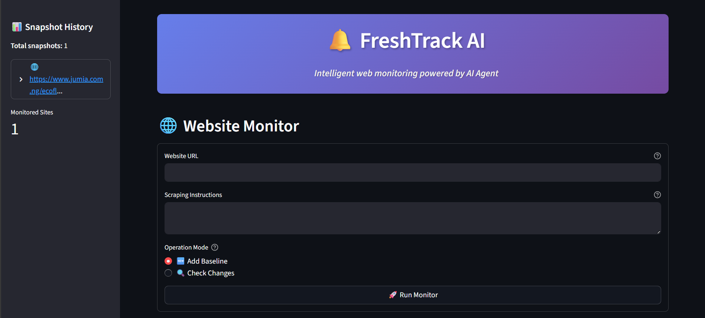
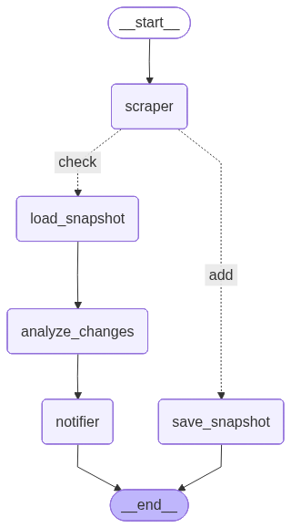

# FreshTrack AI



## Overview

FreshTrack AI is an intelligent web change detection system that monitors websites for meaningful changes using advanced AI agents. Built with LangGraph, it automatically detects when important content changes on your monitored websites and alerts you accordingly.

## Features

- **AI-Powered Detection**: Uses Google Gemini AI Agent to understand content semantically
- **Smart Filtering**: Ignores formatting changes, focuses on meaningful content updates  
- **Historical Tracking**: Maintains snapshot history with timestamps
- **Custom Prompts**: Define exactly what content you want to monitor
- **Web Interface**: Beautiful Streamlit dashboard for easy management
- **Real-time Monitoring**: Instant change detection and notifications
- **Date Tracking**: Full audit trail of when changes occurred



## Technology Stack

- **LangGraph**: Workflow orchestration for AI agents
- **Google Gemini**: Advanced language model for content analysis
- **ScrapeGraphAI**: Intelligent web scraping with AI
- **Streamlit**: Modern web interface
- **Python**: Core application logic

## Installation

1. **Clone the repository**
   ```bash
   git clone https://github.com/amajai/fresh-track-ai.git
   cd fresh-track-ai
   ```

2. **Install dependencies**
   ```bash
   pip install -r requirements.txt
   # or with uv
   uv sync
   ```

3. **Set up environment variables**
   ```bash
   cp .env.example .env
   # Edit .env with your API keys
   ```

4. **Required API Keys**
   - `GOOGLE_API_KEY`: Google Gemini API key

## Usage

### Web Interface (Recommended)

Launch the Streamlit dashboard:
```bash
streamlit run streamlit_app.py
```

Navigate to `http://localhost:8501` and:
1. Enter the website URL to monitor
2. Describe what content you want to track
3. Choose "Add Baseline" to save initial snapshot
4. Use "Check Changes" to detect updates

### Command Line

Run the AI agent directly:
```bash
python main.py
```

Or use the agent programmatically:
```python
from agent import track_agent

# Add baseline
result = track_agent.invoke({
    "url": "https://example.com/product",
    "prompt": "Extract price and availability",
    "mode": "add"
})

# Check for changes
result = track_agent.invoke({
    "url": "https://example.com/product", 
    "prompt": "Extract price and availability",
    "mode": "check"
})
```

## How the AI Agent Works

The system uses a sophisticated LangGraph workflow:

1. **Scraper Agent**: Extracts content using AI-powered web scraping
2. **Snapshot Manager**: Saves/loads historical data with timestamps  
3. **Change Analyzer**: AI agent compares old vs new content semantically
4. **Notifier Agent**: Alerts when meaningful changes are detected

The AI agent is smart enough to:
- Ignore formatting differences (JSON vs text)
- Focus on actual value changes (price, availability, etc.)
- Understand context and semantic meaning
- Provide human-readable change summaries

## Interface Features

- **Snapshot History**: View all monitored sites in sidebar
- **Smart Validation**: Input validation and error handling
- **Beautiful UI**: Gradient banners and modern styling
- **Responsive**: Works on desktop and mobile
- **Real-time**: Live updates and status indicators

## Project Structure

```
fresh-track-ai/
├── agent.py              # Main LangGraph workflow
├── streamlit_app.py       # Web dashboard
├── main.py               # CLI entry point
├── utils.py              # Helper functions
├── test.ipynb            # Jupyter notebook for testing
├── snapshots.json        # Stored website snapshots
├── .env                  # Environment variables
└── resources/
    ├── screen.png        # App screenshot
    └── workflow.png      # Architecture diagram
```

## Configuration

Edit `.env` file to customize:

```env
# LLM Configuration
LLM_PROVIDER=google_genai
LLM_MODEL=gemini-2.5-flash
LLM_TEMPERATURE=0.1

# API Keys
GOOGLE_API_KEY=your_key_here
```

## License

This project is licensed under the MIT License - see the [LICENSE](LICENSE) file for details.
